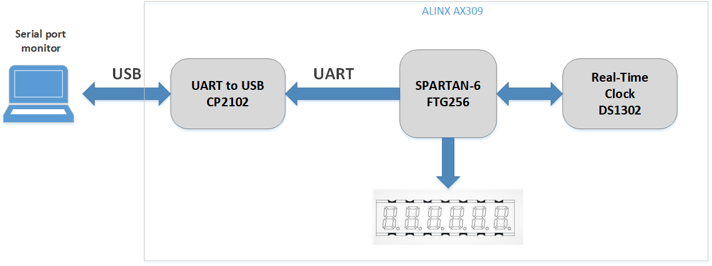

# ALINX-AX309-RTC-UART-VHDL

This simple project has been implemented on an evaluation board (ALINX AX309) based on SPARTAN-6 Xilinx FPGA. The RTC (Real Time Clock) chip (DS1302) mounted on the board is used to get the current time. The time data in (HH:MM:SS) format is read out of RTC chip and is shown on 6-digit 7-segments on the board. Moreover, the time is sent in UART protocol to the on-board chip (CP2102) which implements a virtual serial port through USB port. A serial port utility (like putty or Termite) on PC can be used to show the time on PC. 

The VHDL code consists of three modules to handle RTC [(VHDL_code)](Xilinx_ISE_project/RTC_driver.vhd), 7-segments [(VHDL_code)](Xilinx_ISE_project/seven_segment.vhd), and UART [(VHDL_code)](Xilinx_ISE_project/UART.vhd). These components are unified to the top design module [(VHDL_code)](Xilinx_ISE_project/Main.vhd).   

## Author:
### Hamid Reza Tanhaei
